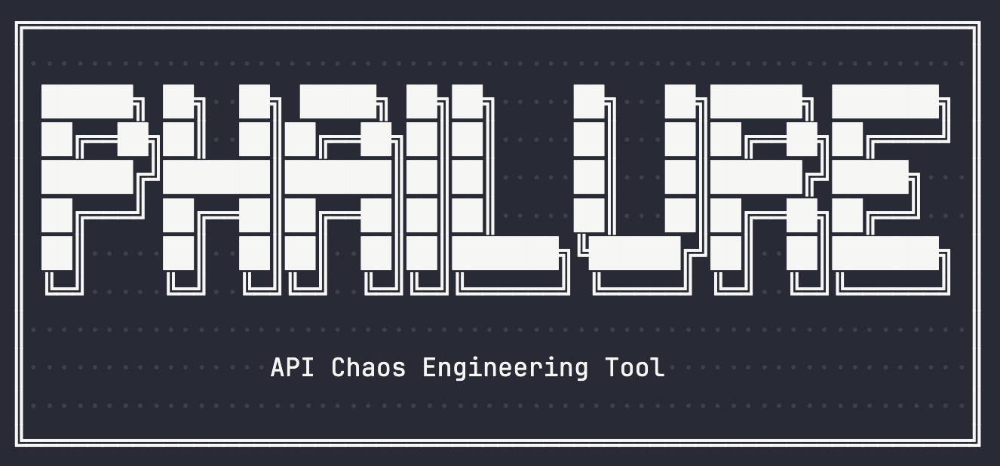

# Phailure



🔥 API Chaos Engineering Tool 🔥

Phailure is a chaos engineering tool for APIs that allows you to inject controlled failures, delays, and timeouts into your HTTP services to test their resilience.

## What is Chaos Engineering?

Chaos engineering is the practice of intentionally introducing failures into your system to identify weaknesses before they cause outages in production. phailure makes this easy by providing a simple proxy that can inject delays, errors, and timeouts without modifying your application code.

Think of it as a "vaccine for your API" - by exposing your system to small, controlled doses of failure, you build immunity against larger, unexpected outages.

## Features

phailure provides three main types of chaos injection:

1. 🐌 Delay Injection: Introduces random delays to simulate network latency or slow dependencies

2. 💥 Error Injection: Returns HTTP error codes to test error handling

3. ⏱️ Timeout Injection: Simulates request timeouts to test timeout handling

## Why Use Phailure?

- **Test Before It Breaks:** Catch potential failure points *before* they hit production.
- **No Code Changes Needed:** Just run it as a reverse proxy. No need to modify your application.
- **Simulate Real-World Failures:** Recreate scenarios like latency, server errors, and timeouts.
- **Improve Reliability:** Build systems that gracefully handle failure, leading to more resilient APIs.
- **Lightweight & Flexible:** Configure via flags or JSON. Observe and adjust chaos in real-time.
- **Great for Dev, Staging, and CI:** Safely test your systems under stress without affecting production.

> If you're serious about uptime and reliability, **Phailure** gives you a safer resiliency testing playground to break and harden your microservice.

## Installation

You can install using following command

```bash
curl -sSL https://raw.githubusercontent.com/pgaijin66/phailure/main/scripts/install.sh | bash
# or

wget -qO- https://raw.githubusercontent.com/pgaijin66/phailure/main/scripts/install.sh | bash
```

## Basic Usage

To start phailure with default settings, you need to specify a target service:

```
./phailure -target=http://localhost:3000
```

What this does:
- Starts phailure on port 8080
- Proxies requests to your service running on port 3000
- Injects delays 10% of the time
- Injects errors 5% of the time
- Injects timeouts 2% of the time

## Custom Configuration

You can customize the chaos behavior using command-line flags:

```
./phailure \
  -target=http://api.example.com \
  -port=9000 \
  -delay-prob=0.2 \
  -delay-min=500ms \
  -delay-max=3s \
  -error-prob=0.1 \
  -error-codes=500,503,504 \
  -timeout-prob=0.05 \
  -timeout-dur=10s
```
This configuration:

1. Runs phailure on port 9000
2. Targets api.example.com
3. 20% delay probability (500ms to 3s delays)
4. 10% error probability (returns 500, 503, or 504 errors)
6. 5% timeout probability (10s timeouts)

You can generate configuration file using `make config-example`

## Configuration Options

### JSON Configuration File
You can also use a JSON configuration file for more complex setups. Create a file like `chaos-config.json`:

```
{
  "delay_enabled": true,
  "delay_min": "600ms",
  "delay_max": "2s", 
  "delay_probability": 0.2,
  "error_enabled": true,
  "error_codes": [500, 502, 503, 504],
  "error_probability": 0.1,
  "error_message": "Chaos engineering fault injection",
  "timeout_enabled": true,
  "timeout_duration": "30s",
  "timeout_probability": 0.05
}
```

Then run phailure with the configuration file:

```
./phailure -target=http://localhost:3000 -config=chaos-config.json
```

💡 Note: The JSON configuration will override any command-line flags you specify.

### Management Endpoints

phailure provides several management endpoints for monitoring and controlling chaos injection:

```
curl http://localhost:8080/_chaos/health
```

### Health Check

Returns the current health status and target information:

```
{
  "status": "healthy",
  "chaos": "enabled", 
  "timestamp": "2025-07-20T17:42:30Z",
  "target": "http://localhost:3000"
}
```

### Statistics

```bash
curl http://localhost:8080/_chaos/stats
```

Provides detailed statistics about chaos injection:

```bash
json{
  "total_requests": 1000,
  "delays_injected": 98,
  "errors_injected": 52,
  "delay_percentage": 9.8,
  "error_percentage": 5.2,
  "uptime": "2h15m30s",
  "config": { ... }
 }
```

### Configuration Management
```
# Get current configuration
curl http://localhost:8080/_chaos/config

# Update configuration
curl -X POST http://localhost:8080/_chaos/config \
  -H "Content-Type: application/json" \
  -d '{"delay_probability": 0.3, "error_
```

💡 Note: You can dynamically update the chaos configuration without restarting phailure, making it easy to adjust chaos levels during testing.

# Usage Examples

## Testing API Resilience

You can develop and run API in any language. Start your API on port 3000 and phailure on port 8080:

```bash
# Terminal 1: Start your API
node server.js

# Terminal 2: Start phailure
./phailure -target=http://localhost:3000 -delay-prob=0.3 -error-prob=0.1

# Terminal 3: Send test requests through phailure
curl http://localhost:8080/api/users
```

What happens: Your application will receive requests through phailure, which will randomly inject delays and errors based on the configured probabilities.


### Load Testing with Chaos

Combine phailure with load testing tools to simulate real-world conditions:

```
# Start phailure with moderate chaos
./phailure -target=http://localhost:3000 -delay-prob=0.2 -error-prob=0.05

# Run load test through phailure
hey -n 1000 -c 10 http://localhost:8080/api/endpoint

```

Result: This tests how your API performs under load while experiencing realistic network issues.

### Gradual Chaos Increase
You can gradually increase chaos levels during testing:

```
# Start with low chaos
./phailure -target=http://localhost:3000 -delay-prob=0.1 -error-prob=0.02

# Increase error rate during testing
curl -X POST http://localhost:8080/_chaos/config \
  -H "Content-Type: application/json" \
  -d '{"error_probability": 0.1}'

# Further increase chaos
curl -X POST http://localhost:8080/_chaos/config \
  -H "Content-Type: application/json" \
  -d '{"delay_probability": 0.3, "error_probability": 0.2}'
```


### Testing Specific Failure Scenarios

Focus on specific types of failures:

```
# Test timeout handling only
./phailure -target=http://localhost:3000 \
  -delay-prob=0 \
  -error-prob=0 \
  -timeout-prob=0.5 \
  -timeout-dur=5s

# Test specific error codes
./phailure -target=http://localhost:3000 \
  -error-codes=503,504 \
  -error-prob=0.3
```
### When using phailure 

For chaos engineering, follow these best practices:

- Start Small
- Monitor Everything
- Test in Stages
- Use Realistic Values
- Document Findings

### FAQs

#### phailure Won't Start

1. Ensure the **target URL** is accessible.  
2. Check that the **specified port** is available and not in use.  
3. Confirm your **target service is running** before starting phailure.

#### No Chaos Being Injected

1. Verify that **probability values** are greater than `0`.  
2. Check that **chaos injection is enabled** in your configuration.  
3. Use the **statistics endpoint** to confirm requests are flowing through phailure.

#### Too Much Chaos

1. If your system is overwhelmed, **reduce the probability values**.  
2. **Disable specific chaos types** (e.g., delay, error, timeout) through the configuration endpoint.

### Debugging

Use the management endpoints to debug issues:

```
# Check if requests are flowing through phailure
curl http://localhost:8080/_chaos/stats

# Verify configuration
curl http://localhost:8080/_chaos/config

# Confirm phailure is healthy
curl http://localhost:8080/_chaos/health
```

Tip: The logs will also show when chaos is being injected, helping you understand the impact on your system.

### Integration with CI/CD

phailure can be integrated into your continuous integration pipeline to automatically test resilience:

TODO
